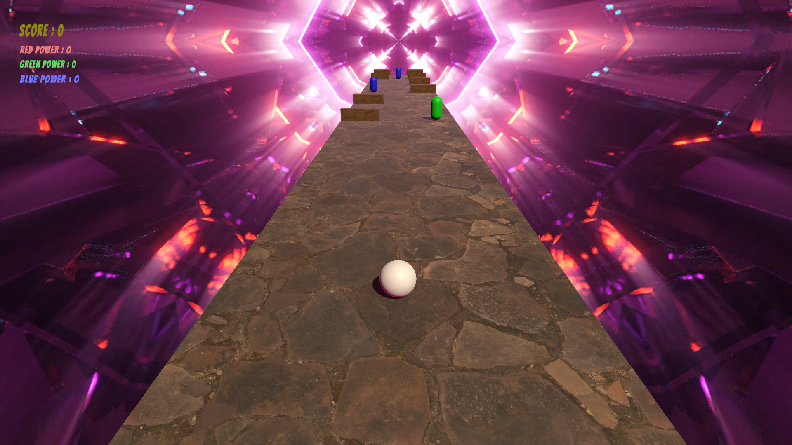

# Power Rangers Endless Runner Game

Welcome to the Power Rangers Endless Runner Game project repository! This project is a simple yet exciting endless runner game inspired by the popular Power Rangers series. In this game, players control a sphere that automatically moves forward on an infinite floor, encountering various obstacles and orbs while striving to achieve the highest score.

## YouTube Demo
[Watch the Power Rangers Endless Runner Game in Action!](https://youtu.be/IkeQ1cdBKlw)

### Gameplay Overview
- **Player Control**: Navigate the game from a third-person perspective, steering left and right to change lanes.
- **Item Collection**: Collect orbs to increase energy points and score, while avoiding obstacles that revert the player's form.
- **Switching Forms**: Accumulate energy points to switch between different forms, each with unique powers.
- **Powers**: Activate special powers corresponding to each form to overcome obstacles and boost performance.

### Rules of Play
- **Movement**: Navigate the game environment, avoiding obstacles and collecting orbs to increase points.
- **Item Generation**: Encounter randomly generated orbs and obstacles across three lanes throughout the game.
- **Energy & Score**: Accumulate energy points and score by collecting orbs, with special bonuses for collecting orbs matching the player's current form.
- **Switching Forms**: Switch between forms when energy points reach maximum levels, utilizing unique powers and abilities.
- **Powers**: Activate special powers associated with each form to gain advantages and overcome obstacles.

### Game Controls
- **Windows Controls**: Use arrow keys or "A" and "D" keys to move left and right, "J", "K", and "L" to switch forms, and "Space Bar" to activate powers. Press "Escape" to pause/resume the game.

### Screens & UI
- **Title Screen**: Start the game, access options (How to Play, Credits, Mute Sound), or quit.
- **Gameplay HUD**: Display energy points, score counter, and pause options during gameplay.
- **Pause Screen**: Choose to resume, restart, or return to the main menu while paused.
- **Game Over Screen**: View final score and choose to restart or return to the main menu after the game ends.

### Sounds
- **Sound Effects/Feedback**: Experience immersive audio feedback for actions such as collecting orbs, switching forms, using powers, and hitting obstacles.
- **Soundtracks**: Enjoy dynamic soundtracks tailored for different game screens, enhancing the gaming experience.
